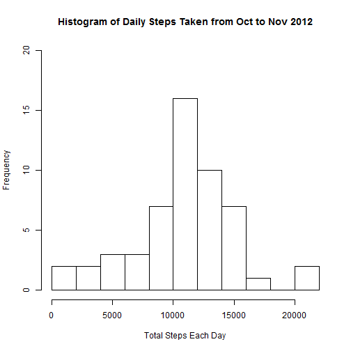
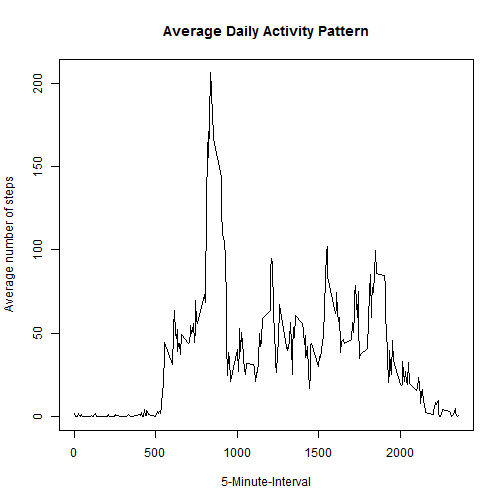
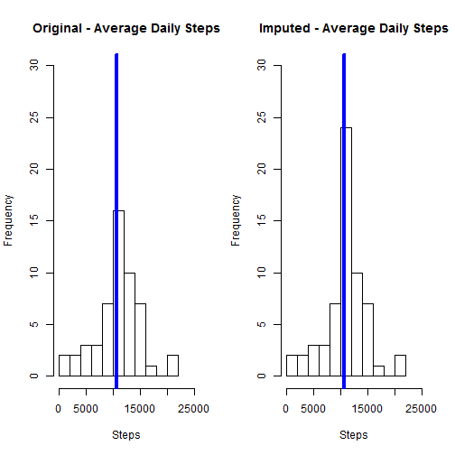
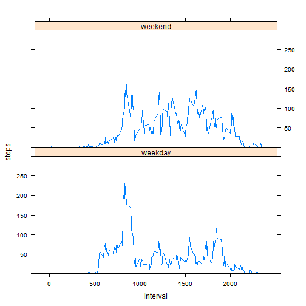

# Reproducible Research: Peer Assessment 1

### 1. Loading and preprocessing the data

```r
file <- unzip("activity.zip")
dfActivity <- read.csv(file, stringsAsFactors = FALSE)
dfActivity$date <- as.Date(dfActivity$date)
str(dfActivity)  
```

```
## 'data.frame':	17568 obs. of  3 variables:
##  $ steps   : int  NA NA NA NA NA NA NA NA NA NA ...
##  $ date    : Date, format: "2012-10-01" "2012-10-01" ...
##  $ interval: int  0 5 10 15 20 25 30 35 40 45 ...
```
  
### 2. What is mean total number of steps taken per day?

```r
dfActivity_rm<-dfActivity[which(!is.na(dfActivity$steps)),]
stepsPerDay<-tapply(dfActivity_rm$steps, dfActivity_rm$date, sum)

hist(stepsPerDay, 10,
      main = "Histogram of Daily Steps Taken from Oct to Nov 2012",
      xlab='Total Steps Each Day',
      ylab='Frequency',
      ylim=c(0, 20))
```

 

```r
cat("Mean:", mean(stepsPerDay))  
```

```
## Mean: 10766.19
```

```r
cat("Median:", median(stepsPerDay))
```

```
## Median: 10765
```

### 3. What is the average daily activity pattern?

```r
avgDailyActivity<-tapply(dfActivity_rm$steps, dfActivity_rm$interval, mean)
plot(y = avgDailyActivity, 
     x = names(avgDailyActivity), 
     type = "l", 
     xlab = "5-Minute-Interval", 
     main = "Average Daily Activity Pattern", 
     ylab = "Average number of steps")
```

 

```r
avgDailyActivity[avgDailyActivity==max(avgDailyActivity)]
```

```
##      835 
## 206.1698
```
The 5-minute interval that contains the maximum average number of steps is at interval 835.  
It recorded a total average of 206.17 steps.  
  

### 4. Imputing missing values
Current situation: The total number of missing values is 2,304 of the total 17,568 observations. All of the missing values fall under the 'Steps' variable.  
The strategy for imputing missing data: Replace missing values (na) with the mean of the 5-minute interval.  
The impact of imputing missing data with the mean of 5-minute interval.
 * For the mean, there is no impact  
 * For the median, there is minimal impact where the median is increased by 1.189  
See results below. 

```r
sum(is.na(dfActivity))
```

```
## [1] 2304
```

```r
sum(is.na(dfActivity$steps))
```

```
## [1] 2304
```

```r
dfActivity_new <- dfActivity
dfActivity_new[which(is.na(dfActivity_new$steps)),1] <-
        avgDailyActivity[as.character(dfActivity_new[which(is.na(dfActivity_new$steps)),3])]
sum(is.na(dfActivity_new))
```

```
## [1] 0
```

```r
stepsPerDay_new<-tapply(dfActivity_new$steps, dfActivity_new$date, sum)

par(mfrow=c(1,2))
hist(stepsPerDay, 10, 
     main = "Original - Average Daily Steps", 
     xlab = "Steps", 
     xlim =c(0, 25000),
     ylim =c(0, 30))
abline(v = median(stepsPerDay), col = 4, lwd = 4)

hist(stepsPerDay_new, 10, 
      main = "Imputed - Average Daily Steps", 
      xlab = "Steps",
      xlim =c(0, 25000),
      ylim =c(0, 30))
abline(v = median(stepsPerDay_new), col = 4, lwd = 4)
```

 

```r
mean(stepsPerDay_new)-mean(stepsPerDay)
```

```
## [1] 0
```

```r
median(stepsPerDay_new)-median(stepsPerDay)
```

```
## [1] 1.188679
```
  

### 5. Are there differences in activity patterns between weekdays and weekends?
There are differences in activity patterns between weekdays and weekends. There are generally more steps taken during weekends. However, notice that during weekdays there is a spike in average steps between interval 800 and 1000.


```r
dayType <- function(dates) 
{
  f <- function(date) 
    {
      if (weekdays(date) %in% c("Saturday", "Sunday")) 
        {
          "weekend"
        }
      else 
        {
        "weekday"
        }
    }
  sapply(dates, f)
}

dfActivity_new$dayType <- as.factor(dayType(dfActivity_new$date))

library(lattice)
dfDisplay <- aggregate(steps ~ interval + dayType, dfActivity_new, mean)
xyplot(steps ~ interval | dayType, 
       data=dfDisplay, 
       ylim = c(0,300), 
       layout=c(1,2), 
       type='l')
```

 

